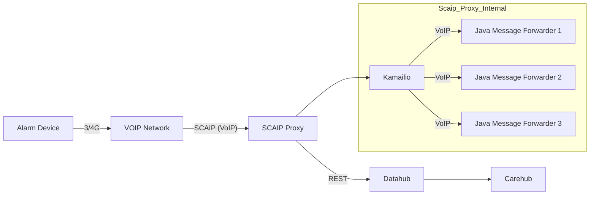

# SCAIP Proxy

A SIP-based server and client for **SCAIP** (Social Care Alarm Internet Protocol), as in SIS SS 91100:2014 and CENELEC 50134-9. It receives SIP MESSAGE requests with SCAIP XML bodies, parses them, and responds with 200 OK and a short XML status.



## Requirements

- **Java 17**
- **Maven 3.6+**

## Build

```bash
mvn clean package -DskipTests
```

Produces `target/scaip-server-1.0.0.jar` (fat jar with server and client).

## Run locally

**Server** (single backend on 5062):

```bash
mvn exec:java -q
# or: java -jar target/scaip-server-1.0.0.jar
```

**Client** against local server:

```bash
./run-local-client.sh
```

## Run client against remote server

- **TCP (no TLS):** `./run-remote-client.sh nossl` — connects to `scaip.syntilio.com:5060` (override with `SCAIP_SERVER_HOST` / `SCAIP_SERVER_PORT`).
- **TLS:** `./run-remote-client.sh` — uses local stunnel to `scaip.syntilio.com:5061` (requires `stunnel` and `server-config/stunnel-client-scaip.conf`).

**Benchmark:** `./run-remote-client-benchmark.sh` or `./run-remote-client-benchmark.sh nossl` (same TLS vs TCP choice).

### Voic peep test client (voice call + RTP peep)

Test client that places a SIP voice call to a voic trunk (INVITE), sends a short peep tone as RTP PCMU, then hangs up (BYE). Useful for testing trunks that auto-answer and record.

```bash
./run-voic-peep.sh
```

Override trunk (and other options) with environment variables:

```bash
VOIC_TRUNK_HOST=192.168.1.10 VOIC_TRUNK_PORT=5060 VOIC_TRUNK_USER=voic ./run-voic-peep.sh
```

Or run via Maven: `mvn exec:java@run-voic-peep -q`. **Behind NAT:** the client auto-detects your local IP; many trunks still work because they send 200 OK to the request source. If the trunk must reach you (e.g. strict Via routing), set `VOIC_PUBLIC_HOST` to your public IP and forward SIP (5064) and RTP (10000) ports to the client host.

## Server deployment (production)

Production runs **Kamailio** as the edge (TCP 5060, TLS 5061), load-balancing to multiple **Java SCAIP backends** on localhost (default: 5 backends on 5062–5066). Each backend is a separate JVM with a fixed heap (e.g. 600 MB when 3 GB is shared across 5 on a 4 GB host).

1. **Provision** a host (e.g. Hetzner) and use `server-config/hertzner-init.yml` as cloud-init user data, or clone the repo and run the bootstrap manually.
2. **Bootstrap:** `server-config/bootstrap.sh` — builds the project, installs systemd units for the backends, Kamailio, TLS (Let’s Encrypt), and Apache.
3. **Config:** Copy `server-config/kamailio.cfg` and `server-config/dispatcher.list` to the server (e.g. `/etc/kamailio/`) and restart Kamailio.
4. **DNS:** Point your domain’s A record at the server IP; optionally add SRV records so clients can discover the SIP port (see [server-config/DNS-SRV.md](server-config/DNS-SRV.md)).

## Documentation

| Doc | Description |
|-----|-------------|
| [ARCHITECTURE.md](ARCHITECTURE.md) | High-level flow: Kamailio → Java backends → logs |
| [SCAIP_PROTOCOL.md](SCAIP_PROTOCOL.md) | SCAIP XML format, tags, and transport |
| [SCALING.md](SCALING.md) | Changing the number of backends and Java heap |
| [server-config/DNS-SRV.md](server-config/DNS-SRV.md) | DNS SRV records for SIP/SIPS discovery |

## License

Proprietary. Copyright (c) Syntilio b.v. See [LICENSE](LICENSE).
