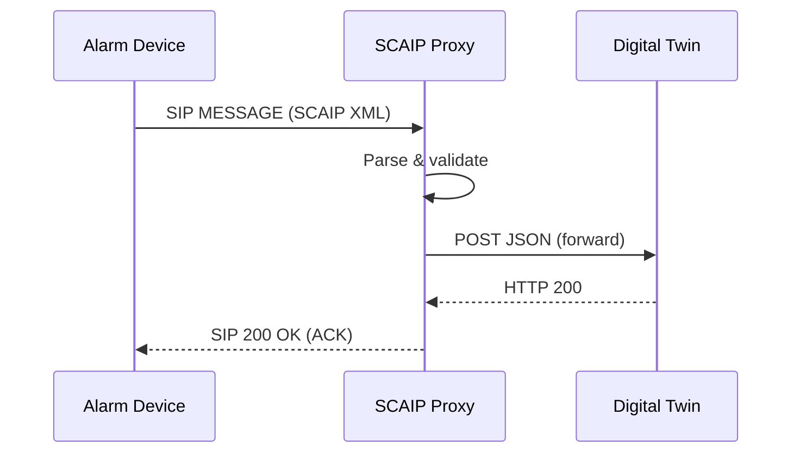
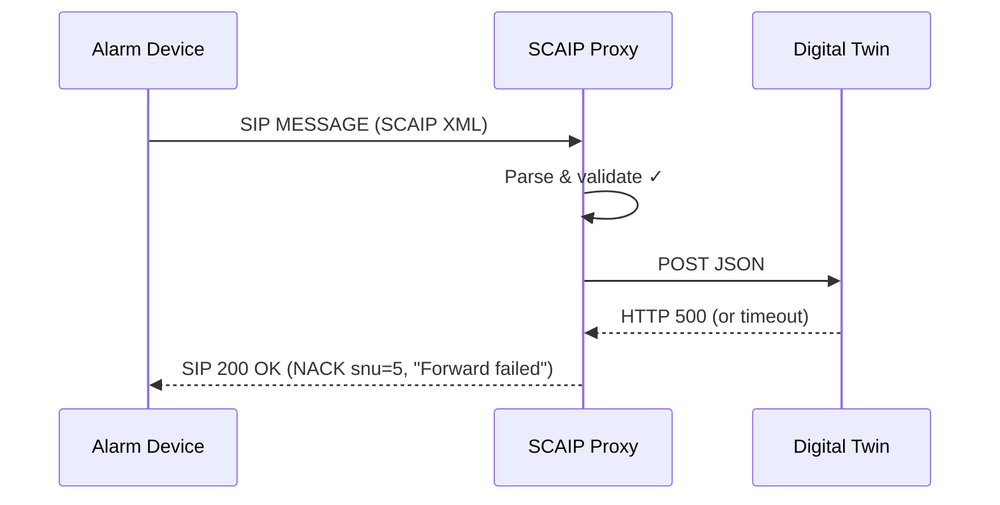

# SCAIP forward flow: Alarm Device → SCAIP Proxy → Digital Twin

```mermaid
sequenceDiagram
    participant AD as Alarm Device
    participant Proxy as SCAIP Proxy
    participant DT as Digital Twin

    AD->>+Proxy: SIP MESSAGE (SCAIP XML)
    Note over Proxy: Parse XML, validate

    alt Valid SCAIP
        Proxy->>+DT: POST /... (application/json)
        Note over DT: Process event
        DT-->>-Proxy: HTTP 200 (or 2xx)

        alt Forward 2xx
            Proxy-->>-AD: SIP 200 OK (ACK, snu=0)
        else Forward non-2xx or error
            Proxy-->>-AD: SIP 200 OK (NACK, snu=5, "Forward failed")
        end
    else Invalid SCAIP (wrong Content-Type, parse error, missing tag)
        Proxy-->>-AD: SIP 200 OK (NACK, snu=2/7, reason)
    end
```

## Simplified (happy path only)



## With NACK path (forward failure)


